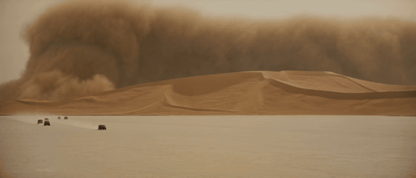
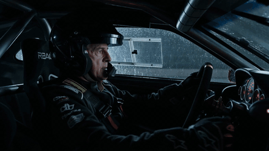
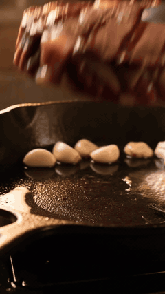

<div align="center">

# ai-video 🎬

**The AI video skill that learns.**

End-to-end video generation for [Claude Code](https://claude.com/claude-code) — across six models, from prompt to finished cut. It quality-controls every clip it makes, and gets better at prompting with each one.


</div>

---

Most AI-video tooling stops at "here's your clip." ai-video doesn't. Every
generation ends with a **quality-control pass** — Claude watches the rendered
clip, scores it against the prompt, and writes down what it learned. That
lesson is loaded back in before the next prompt is written. The skill is not
static; it compounds.

It also covers the *whole* job, not just the model call: generate a first
frame, write the prompt, run it on the right model, synthesize voiceover,
stitch the clips, upscale for delivery.

## Showcase

Real clips, real prompts — each generated with the structure this skill
teaches. Open a prompt to see the 5-part craft.

<table>
<tr>
<td width="50%" align="center"><br/><sub><b>Desert Convoy</b> · <code>seedance-2.0</code> · 21:9 · 15s</sub></td>
<td width="50%" align="center"><br/><sub><b>Wet Track Green Light</b> · <code>seedance-2.0</code> · 16:9 · 15s</sub></td>
</tr>
</table>

<details>
<summary><b>Desert Convoy Before the Wall</b> — scale needs human pressure</summary>

```text
[00:00-00:05] Extreme wide IMAX 70mm desert shot in the Denis Villeneuve and
Greig Fraser register: a tiny armored convoy races across hard salt flats
while a mile-high sandstorm advances behind it, desaturated ochre palette,
enormous negative space.
[00:05-00:10] Cut inside the lead rover, medium close-up of the driver
gripping the wheel at ten and two, dashboard amber reflected in the visor.
Camera shakes with engine vibration. He says, "Do not slow down." Sand
hammers the windshield.
[00:10-00:15] Exterior low tracking shot as the rover crests a dune in real
time, not slow motion. Dust swallows the frame, distant bass rumble, no gore,
no text, hard cut to black.
```
</details>

<details>
<summary><b>Wet Track Green Light</b> — fixed hands reduce warping</summary>

```text
[00:00-00:05] Interior cockpit medium close-up of a veteran race driver at
night, rain lashing the windshield, dashboard LEDs reflected in the visor. He
tightens both gloved hands on the wheel at ten and two, breathing steady.
[00:05-00:10] Cut to rival cockpit, younger driver in the next car, jaw
tense, eyes forward, engine vibration shaking the frame. He whispers, "Hold
the line."
[00:10-00:15] Low exterior tracking shot as the green light hits and both
cars accelerate in real time on wet asphalt. Massive water spray hits the
lens, stadium lights stretch into motion blur, engines roar, no limb
distortion, no text.
```
</details>

<table>
<tr>
<td width="50%" align="center"><br/><sub><b>Cast-Iron Steak ASMR</b> · <code>seedance-2.0</code> · 9:16 · 8s</sub></td>
<td width="50%" align="center"><br/><sub><b>Mercury Sphere Loop</b> · <code>seedance-2.0</code> · 1:1 · 6s</sub></td>
</tr>
</table>

<details>
<summary><b>Cast-Iron Steak ASMR</b> — name the sound source</summary>

```text
Extreme macro close-up of a steak hitting a black cast-iron skillet,
background fully blurred. Fat renders, bubbles along the crust, butter foams
around rosemary and garlic, steam blooms into warm tungsten light. Slow
dolly-in, probe-lens feel, razor-thin depth of field. Audio: aggressive
sizzle, fat crackle, one tong clink at end, no music, no voice, no text.
```
</details>

<details>
<summary><b>Mercury Sphere Loop</b> — match first and last frames</summary>

```text
Loop-ready studio macro shot of a perfect liquid mercury sphere on a black
mirror surface. Locked camera, centered composition, cool white strip lights
reflected across the metal. Over 6 seconds the sphere slowly deforms into a
rounded cube under an invisible force, then returns exactly to the original
sphere shape by the final frame. First and last frames match for seamless
playback. No text, no logo, no extra objects, no camera movement.
```
</details>

All four prompts — and 26 more — ship in [`examples/prompts.json`](examples/prompts.json).

## Features

<table>
<tr>
<td width="50%"><b>🧠 Self-improving</b><br/>A built-in QC loop watches each clip and appends a prompting lesson to <code>LESSONS.md</code>. Every future prompt builds on it.</td>
<td width="50%"><b>🎥 Six models, one schema</b><br/>Seedance 2.0, Kling 3.0, Wan 2.7, Veo 3.1, OmniHuman 1.5, VEED Fabric — authored once, auto-routed by intent.</td>
</tr>
<tr>
<td><b>🪄 Full pipeline</b><br/>Image gen → prompt → generate → QC → voiceover → stitch → upscale. A single clip or a stitched episode.</td>
<td><b>📐 Real prompt craft</b><br/>The canonical 5-part structure, time-coded blocks, a 10-category prompt library, and a 15-entry failure-mode catalog.</td>
</tr>
<tr>
<td><b>🔁 Multimodal</b><br/>Character consistency, motion transfer, lip-sync, talking avatars — first-class, with schema validation before every spend.</td>
<td><b>🙂 "A video of me"</b><br/>A personal profile wires your avatar + cloned voice into any request. Stays local, never committed.</td>
</tr>
</table>

## Install

```bash
git clone https://github.com/0xadvait/ai-video-skill.git ~/.claude/skills/ai-video
pip install -r ~/.claude/skills/ai-video/scripts/requirements.txt
```

`ffmpeg` + `ffprobe` must be on `PATH` (frame QC, stitching, upscaling). The
skill activates automatically — just ask Claude Code to make a video.

> **Heads up:** API keys are read from the environment. You only need a key
> for the models you actually call (see [Environment](#environment)).

## The pipeline

A single clip needs only stages 2–4. A finished video runs the whole chain.

| # | Stage | Script | What it does |
|:-:|-------|--------|--------------|
| 1 | **Still** | `imagegen.py` | First-frame / reference images — Flux Schnell, Flux Pro, Imagen 4 |
| 2 | **Prompt** | `SKILL.md` + `reference/` | 5-part structure (Subject→Action→Camera→Style→Constraints) + time-coded blocks |
| 3 | **Generate** | `validate.py` → `generate.py` | Validate the request, run on the auto-routed model |
| 4 | **QC + learn** | `review.py` → `LESSONS.md` | Watch the clip, score it, record a prompting lesson |
| 5 | **Voiceover** | `tts.py` | ElevenLabs text-to-speech narration |
| 6 | **Assemble** | `assemble.py` | Stitch clips — cuts/crossfades + audio bed — from a JSON edit list |
| 7 | **Finish** | `upscale.py` | Upscale resolution + interpolate frame rate |

## Models

One canonical schema (Seedance 2.0's). `generate.py` translates it to whichever
model is chosen — `"model": "auto"` (default) routes by intent.

| Model | Backend | Best for |
|-------|---------|----------|
| `seedance-2.0` | Replicate | Generalist — quad-modal refs, native audio, lip-sync, motion transfer |
| `kling-3.0-omni` | fal | t2v / i2v with a different moderation gateway (the `--fallback`) |
| `wan-2.7-i2v` | Replicate | Open-weights image-to-video |
| `veo-3.1` | Google Gemini | Highest-realism cinematic text-to-video |
| `omnihuman-1.5` | fal | Audio-driven talking avatar, gesture-rich |
| `veed-fabric-1.0` | fal | Mouth-only lip-sync — included, but see `LESSONS.md` |

## The learning loop

This is the part that makes it more than a wrapper:

```
prompt ──▶ generate ──▶ review.py ──▶ Claude watches the clip
   ▲                                          │
   │                                          ▼
LESSONS.md ◀────────────── distill a generalizable lesson
```

`review.py` extracts a frame contact sheet; Claude scores the clip on prompt
fidelity, consistency, motion, and audio; a one-line cause→effect lesson is
appended to `LESSONS.md`. Step 0 of every workflow reads `LESSONS.md` back in.
**No regeneration is needed for the skill to improve** — clips are only re-run
when you ask.

## Documentation

| File | What's inside |
|------|---------------|
| [`SKILL.md`](SKILL.md) | The workflow, model routing, QC loop, hard rules |
| [`LESSONS.md`](LESSONS.md) | Seed lessons + the skill's growing memory |
| [`reference/schema.md`](reference/schema.md) | Canonical Seedance 2.0 request schema |
| [`reference/prompt-logic.md`](reference/prompt-logic.md) | 10 prompt categories, theory + perfect examples |
| [`reference/style-library.md`](reference/style-library.md) | Cross-model camera / lens / lighting / director vocabulary |
| [`reference/real-person.md`](reference/real-person.md) | Real-person workflow + production stacks |
| [`reference/failure-modes.md`](reference/failure-modes.md) | 15 failure modes and their fixes |
| [`examples/prompts.json`](examples/prompts.json) | 30 verified, paste-ready prompts |

## Environment

| Variable | Used by |
|----------|---------|
| `REPLICATE_API_TOKEN` | seedance-2.0, wan-2.7-i2v, Flux stills, ML upscale |
| `FAL_KEY` | kling-3.0-omni, veed-fabric-1.0, omnihuman-1.5 |
| `GEMINI_API_KEY` | veo-3.1, Imagen 4 stills |
| `ELEVENLABS_API_KEY` | `tts.py` voiceover |

## Personal profile

The "a video of me" shortcut uses a personal profile. Copy the template and
fill in your own assets:

```bash
cp profile/profile.example.json profile/profile.json
```

`profile.json` is git-ignored — your avatar paths and voice id never leave
your machine.

## A note on real-person video

Real-person generation is policy-sensitive. Only build around **public
figures in legitimate commentary or satire**, or **consenting, tagged
collaborators** — never undisclosed impersonation of private individuals.
Respect voice-provider restrictions when sourcing reference audio. See
[`reference/real-person.md`](reference/real-person.md).

## Contributing

Issues and PRs welcome — new verified prompts for `examples/prompts.json`,
model adapters in `scripts/generate.py`, and reference-doc corrections are all
fair game. Keep prompt examples real (rendered, not invented).

## License

[MIT](LICENSE) © 2026 Advait Jayant.

---

<div align="center">

Built from the [ai-video-guide](https://github.com/0xadvait/ai-video-guide) research corpus.

🎬 Generated with [Claude Code](https://claude.com/claude-code)

</div>
